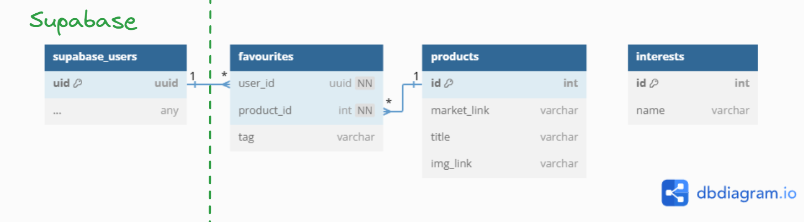
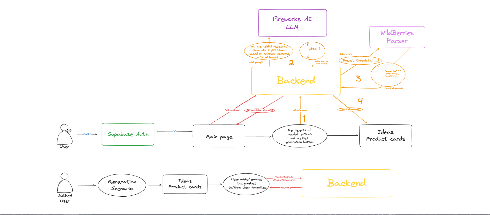
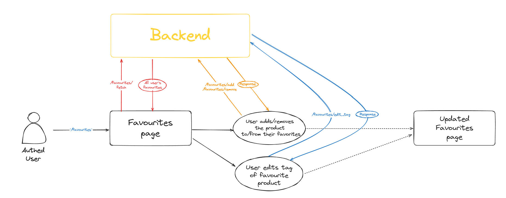
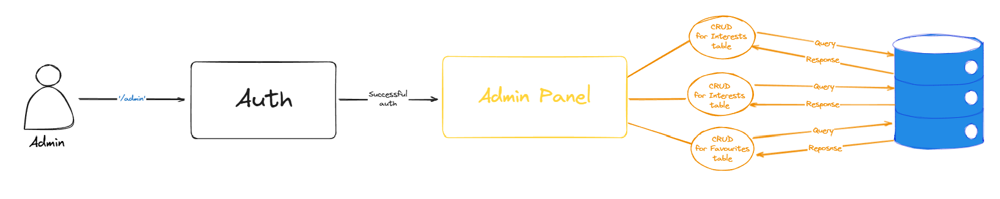
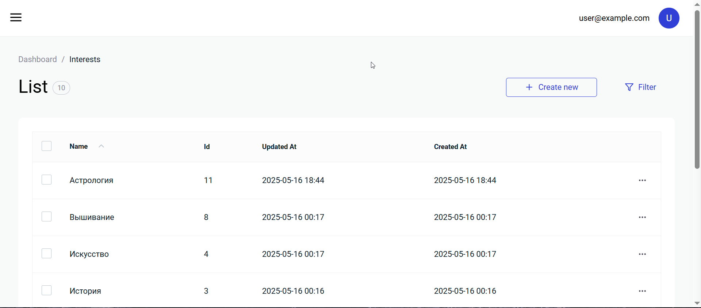

# GiveGift - делаем людей счастливыми!

## Оглавление

- [GiveGift - делаем людей счастливыми!](#givegift---делаем-людей-счастливыми)
  - [Оглавление](#оглавление)
  - [Описание реализуемой идеи](#описание-реализуемой-идеи)
  - [Демо](#демо)
  - [Облачная платформа и стек](#облачная-платформа-и-стек)
  - [Структурная схема с обоснованием](#структурная-схема-с-обоснованием)
      - [Схема базы данных](#схема-базы-данных)
      - [Планируемая нагрузка](#планируемая-нагрузка)
      - [Масштабирование](#масштабирование)
      - [Структура приложения](#структура-приложения)
        - [Основной flow приложения](#основной-flow-приложения)
        - [Избранное](#избранное)
        - [Админ панель бэкенда](#админ-панель-бэкенда)
      - [Методы REST API](#методы-rest-api)
        - [Основной функционал](#основной-функционал)
        - [Избранное](#избранное-1)
        - [Админ панель](#админ-панель)


## Описание реализуемой идеи

Каждому из нас знакома ситуация, когда сложно выбрать подарок для близкого человека.

GiveGift - ваш умный помощник в этом вопросе!
Сервис, используя ИИ, на основе предпочтений вашего партнёра предложит самые подходящие идеи подарков. 

И главное - вы сразу увидите удобный подбор с прямыми ссылками на маркетплейсы _(выбран Wildberries)_ для быстрой и лёгкой покупки!

Если какой-либо из предложенных товаров понравился, его можно добавить в избранное. Для каждого понравившегося продукта можно написать тег, чтобы было легче искать подарки.

## Демо

Генерация идей:

https://github.com/user-attachments/assets/8ee3ea5d-558c-42eb-a8a5-2d2262ed3307

Избранное:

https://github.com/user-attachments/assets/34cdc54b-8fd9-44b5-a215-2182affb0240

## Облачная платформа и стек
* В качестве стека разработки будет выбран **PERN stack** _(PostgreSQL + express + React js + node.js)_:
   * PostgreSQL давно зарекомендовал себя как быстрый и стабильный движок со зрелой системой репликации и бэкапов. Также не стоит забывать про ACID-транзакции, ограничения целостности, внешние ключи и триггеры, которые в совокупности дают надежность при работе с данными
   * Легковесный и гибкий backend в виде Node.js + express позволяет достичь максимальной эффективности при работе с большим числом одновременных соединений, при этом имея минимальный легкорасширяемый каркас _(можно запросто расширить middleware по мере необходимости)_
   * Современный frontend в виде React.js _(на самом деле, React+TS+Vite)_, который имеет понятную структуру UI, где каждый компонент представляет какую-то логику и стили. Также не стоит забывать, что React имеет богатый экосистемный слой, который со временем все больше нарастает, предлагая все более приятные решения _(React Router, Redux/MobX/Recoil для стейта, UI-библиотеки по типу Material UI и т.д.)_
* В виде целевой облачной платформы предлагается выбрать Yandex Cloud, т.к. он имеет большое комьюнити, множество различных сервисов, и обширную документацию.

* В реализации проекта мне понадобятся следующие сервисы от Yandex Cloud:
  * **Compute Cloud** - собственно, виртуальная машина. `Ubuntu 24.04 LTS + 20gb SSD + 2 vCPU + 2GB RAM + публичный IP-адрес` = **3.49 руб/час**
  * **Managed Service for PostgreSQL** - в проекте используем PostgreSQL, поэтому берем соответствующий сервис. 
    * Посчитаем стоимость часа работы для хостов PostgreSQL класса `s3-c2-m8` _(Intel Ice Lake, 2 × 100% vCPU, 8 ГБ RAM)_: 3 * (2 × 1.7604 руб + 8 * 0.4752 руб) = 21.9672 руб, где:
      * 3 - количество хостов PostgreSQL
      * 2 - количество vCPU
      * 1.7604 руб - стоимость часа использования 100% vCPU
      * 8 - объем RAM одного хоста PostgreSQL _(в гигабайтах)_
      * 0.4752 руб - стоимость часа использования 1 ГБ RAM на 100% vCPU
    * Возьмем в расчет стоимость хранилища. Хранить будем на сетевых HDD-дисках объемом в 10GB. Цена за месяц использования 1 ГБ хранилища на сетевых HDD-дисках равна 3.4560 руб.**Итого получаем: 21.9672 руб + 3 * (10 * 0.0048 руб) = 23.4072 руб/час**, где:
      * 21.9672 руб - стоимость часа работы хостов PostgreSQL _(выше считали)_
      * 3 - количество хостов PostgreSQL
      * 10 - объем хранилища на сетевых HDD-дисках _(в гигабайтах)_
      * 0.0048 руб = (3.4560 / (24*30)) руб - стоимость часа использования 1 ГБ хранилища на сетевых HDD-дисках
  * **Managed Service for Kubernetes** - для разворачивания кластера k8s. Для `Managed Kubernetes. Zonal Master - small` стоимость получается **9.5040 руб/час**
  * Возможно использование **Yandex Container Registry**. Цена складывается из объема хранилища, занятого данными, и из объема исходящего трафика:
    * Использование 1 ГБ хранилища стоит **3.24 руб/месяц**
    * Первые 100 ГБ исходящего трафика в месяц не тарифицируются
    * Также есть сканирование образа на предмет уязвимостей. Первичное сканирование Docker-образа на наличие уязвимостей, первые шесть сканирований в месяц не тарифицируются.
  * Возможно использование **Yandex Network Load Balancer**. Имеет только квоты и лимиты, тарифом не облагается

* Также мне понадобятся пара сторонних _(в плане не связанных с выбранной целевой платформой Yandex Cloud)_ сервисов:
  * Supabase - надежная авторизация и хранение информации о пользователях. Также из коробки можно настроить авторизацию через провайдеров по типу Google, что несомненно удобно. Используется `Free plan`.
  * Fireworks AI - "fastest inference for generative AI" по их словам. Но мне больше понравилась обширная model library с неплохим ценником за инференс + выдается 1\$ кредит новым пользователям. Используется легковесная модель [`Qwen3 30B-A3B $0.15/M Input, $0.60/M Output`](https://fireworks.ai/models/fireworks/qwen3-30b-a3b).

## Структурная схема с обоснованием

#### Схема базы данных


* `supabase_users` - неявная таблица `Users`, хранящаяся в Supabase. От нее _(по крайней мере, на текущий момент)_ нам только требуется User ID для определения избранных товаров пользователя
* `favourites` - сама таблица избранных товаров. Хранит для пользователя `user_id` его избранный товар `product_id` с опциональным тегом `tag`
* `products` - таблица товаров. Описываются его название `title`, ссылка на маркетплейс `market_link` и ссылка на его обложку `img_link`
* `interests` - таблица предлагаемых пользователю интересов. При генерации идей подарков, интересы человека выбираются именно оттуда _(сделал я это намеренно, т.к. если пользователь напишет что-то не то, это может сломать промпт, и LLM вероятно сгаллюционирует)_

Также предусмотрен следующий _on cascade_: если продукт удаляется, то и связанные с ним избранные товары тоже удаляются.
_(с пользователем такое не особо выполнимо, т.к. опять же мы подтягиваем его извне)_

#### Планируемая нагрузка 
TODO: необходимо спланировать целевую нагрузку системы (количество пользователей, количество запросов каждого типа и пр.) и учитывать это при проектировании всей системы и документации.

#### Масштабирование
TODO: необходимо продумать как система может быть масштабирована как в сторону увеличения нагрузки/пользователей/объема данных в системе, интенсивности траффика и пр., так и в сторону уменьшения.

#### Структура приложения
Рассмотрим с высоты птичьего полета схему работы приложения.

##### Основной flow приложения

1. Войдя в аккаунт, пользователь попадает на главную страницу
2. В этот же момент с backend'а подгружается пулл интересов, из которых впоследствии пользователь сможет выбирать
3. Пользователь выбирает интересы, ценовой диапазон, настраивает фильтр, и нажимает на кнопку запуска генерации идей.
   * Отправляется соответствующий запрос на backend
   * Промпт с выбранными пользователем идеями отправляется модели из Fireworks AI
   * Модель возвращает идеи в JSON-формате. Из JSON'а достается массив идей
   * Этот массив идей отправляется Wildberries Parser'у, который вернет набор товаров в нужном формате
   * Данный набор товаров и показывается пользователю в виде карточек 
4. Пользователь может добавлять показанные товары в избранное/удалять из избранного



##### Избранное

1. Авторизованный пользователь попадает на страницу избранного
2. В этот же момент с backend'а подгружаются избранные товары
3. Пользователь может добавлять/удалять товары в избранное/из избранного; также может изменять тег товара
4. После проделанных операций изменения применяются и страница избранного обновляется



##### Админ панель бэкенда

1. Войдя в систему, админ попадает на админ панель
2. Админ может проделать CRUD операции над таблицами избранного, товаров и интересов
3. После проделанных операций изменения применяются и панель обновляется



#### Методы REST API

По идее, можете пощупать демо в [PostmanCanary](https://postman.postman.co/workspace/My-Workspace~837bfc7e-172a-4f57-83e3-dc40043f22b4/collection/10982472-72799705-a517-4fe4-818f-dbdc38fb5d2e?action=share&creator=10982472).

##### Основной функционал
1. `POST /ideas/generate` - генерирует подарки по заданным параметрам

    В теле запроса:
    * `interests` - список интересов, которые будут использоваться для генерации подарков
    * `price_range` - диапазон цен, которые будут использоваться для генерации подарков
    * `is_adult` - флаг, указывающий, является ли генерация подарков для взрослых _(пропускать на выход 18+ товары или нет)_

    В ответ приходит массив объектов, каждый из которых содержит:
    * `market_link` - ссылка на товар в маркетплейсе
    * `title` - название товара
    * `img_link` - ссылка на обложку товара

    Пример тела запроса:
    ```json
    {
        "interests": [
            "Театр",
            "Кино",
            "Романы"
            ],
        "price_range": [
            0,
            150000
        ],
        "is_adult": false
    }
    ```

    Пример ответа:
    ```json
    [
        {
            "market_link": "https://www.wildberries.ru/catalog/96758496/detail.aspx",
            "title": "Билет на балет",
            "img_link": "https://basket-05.wbbasket.ru/vol967/part96758/96758496/images/big/1.webp"
        },
        ...
        {
            "market_link": "https://www.wildberries.ru/catalog/204065222/detail.aspx",
            "title": "Санкт-Петербург. Туристическая карта",
            "img_link": "https://basket-13.wbbasket.ru/vol2040/part204065/204065222/images/big/1.webp"
        }
    ]
    ```

2. `GET /interests/all` - возвращает список всех доступных интересов

    Пример ответа:
    ```json
    [
        "Кино",
        "Романы",
        "История",
        "Искусство",
        "Литература",
        "Сладости",
        "Цветы",
        "Вышивание",
        "Астрология"
    ]
    ```

##### Избранное

1. `GET /favourites/fetch?userID=<user_id>` - возвращает список избранных товаров пользователя `user_id`

    Параметры запроса:
    * `user_id` - идентификатор пользователя

    В ответ приходит массив объектов, каждый из которых содержит:
    * `userID` - идентификатор пользователя
    * `tag` - тег товара
    * `market_link` - ссылка на товар в маркетплейсе
    * `title` - название товара
    * `img_link` - ссылка на обложку товара

    Пример ответа:

    ```json
    [
        {
            "userID": "f4552192-1a6d-4b76-9ce4-784424e6189d",
            "tag": "Привет",
            "market_link": "https://www.wildberries.ru/catalog/348760835/detail.aspx",
            "title": "Смоленские украсы орнаменты народной вышивки",
            "img_link": "https://basket-19.wbbasket.ru/vol3487/part348760/348760835/images/big/1.webp"
        },
        ...
        {
            "userID": "f4552192-1a6d-4b76-9ce4-784424e6189d",
            "tag": null,
            "market_link": "https://www.wildberries.ru/catalog/156499895/detail.aspx",
            "title": "Загадки истории. Древние цивилизации",
            "img_link": "https://basket-10.wbbasket.ru/vol1564/part156499/156499895/images/big/1.webp"
        },
    ]
    ```

2. `POST /favourites/add` - добавляет товар в избранные

    В теле запроса объект, описывающий товар:
    * `market_link` - ссылка на товар в маркетплейсе
    * `title` - название товара
    * `img_link` - ссылка на обложку товара

    Пример тела запроса:
    ```json
    {
        "userID": "f4552192-1a6d-4b76-9ce4-784424e6189d",
        "market_link": "https://www.wildberries.ru/catalog/258805225/detail.aspx",
        "title": "Бюро расследования судеб",
        "img_link": "https://basket-16.wbbasket.ru/vol2588/part258805/258805225/images/big/1.webp",
        "tag": "test"
    }
    ```

    Пример ответа:
    ```json
    {
        "id": 28,
        "tag": "test",
        "user_id": "f4552192-1a6d-4b76-9ce4-784424e6189d",
        "product_id": 1,
        "updatedAt": "2025-05-18T00:04:49.456Z",
        "createdAt": "2025-05-18T00:04:49.456Z"
    }
    ```

3. `DELETE /favourites/remove?userID=<user_id>&market_link=<market_link>` - удаляет товар из избранных
   
    Параметры запроса:
    * `user_id` - идентификатор пользователя
    * `market_link` - ссылка на товар в маркетплейсе

    Пример ответа:
    ```json
    {
        "message": "Removed from favourites"
    }
    ```

4. `PATCH /favourites/edit_tag?userID=<user_id>&market_link=<market_link>` - изменяет тег товара в избранных

    Параметры запроса:
    * `user_id` - идентификатор пользователя
    * `market_link` - ссылка на товар в маркетплейсе

    Тело запроса:
    * `tag` - новый тег

    Пример тела запроса:

    ```json
    {
        "tag": "test"
    }
    ```

    Пример ответа:
    ```json
    {
        "message": "Tag updated"
    }
    ```
   
##### Админ панель

На сервере есть админка на базе AdminJS с базовой аутентификацией. Для этого нужно перейти по адресу `/admin`.

Скриншот панели в таблице `Interests`:
 
